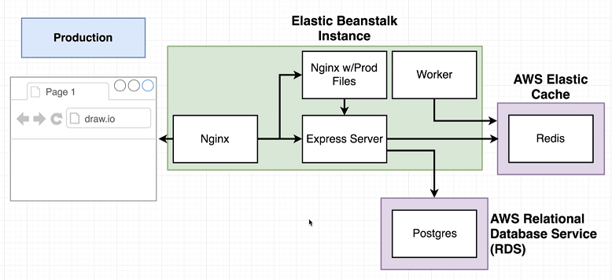
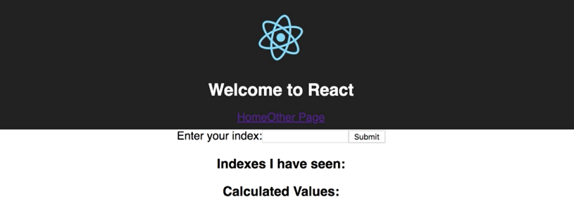

# Application Architecture

This application is using services hosted in containers using ECS via Elastic Beanstalk and AWS managed services listed as below:
-  **Container**
   1. nginx (Nginx)
   2. api (Express Server)
   3. client (Nginx w/Prod Files)
   4. worker (Worker)
- **AWS Managed Service**
   1. Redis
   2. Postgres

**nginx** service will interact with the end-user to receive input and post output.  
It will then forward the request to **api** and **client** service based on the URI path.  
**client** service will respond to the query with index file and other files for the UI content on the web browser.  
**api** service will respond to the query with the value requested on the web page.  
**api** service will fetch the value from the **redis** if it is cached in it or if not than **worker** service will calculate the value and cache it in **redis**.  
**postgres** db will store the inputs for which the value has been calculated.

**Indexes I have seen** are stored in **postgres**  
**Calculated values** are stored in **Redis**